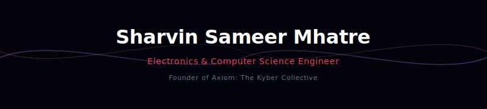
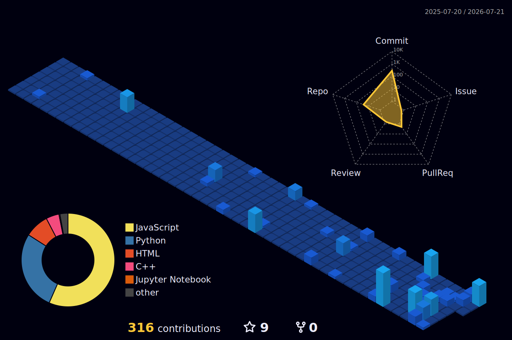
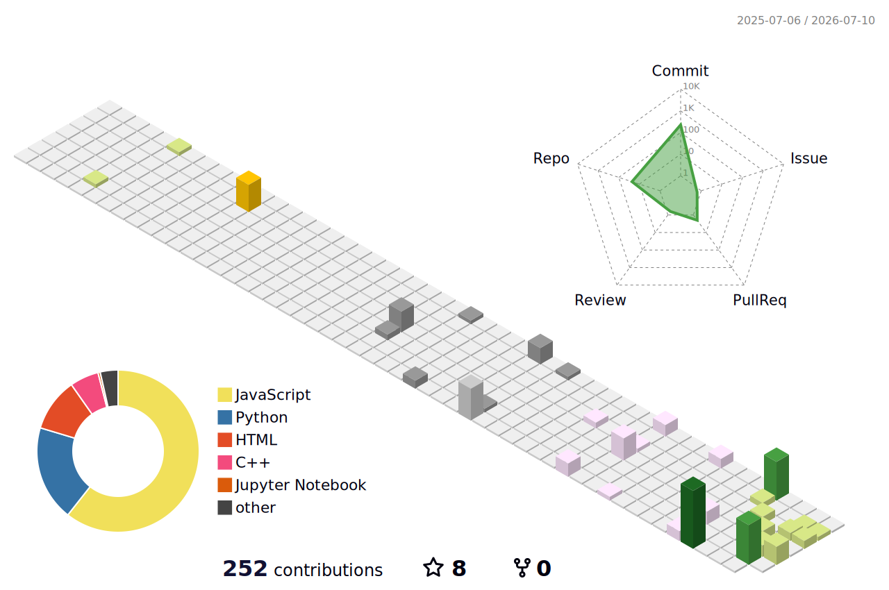
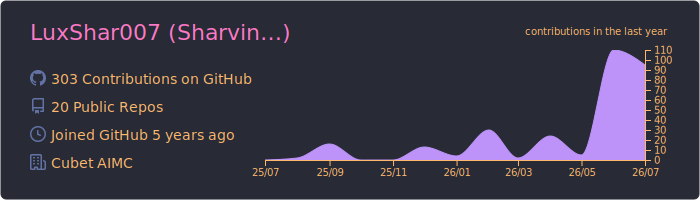
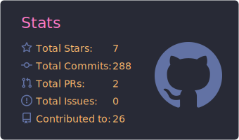
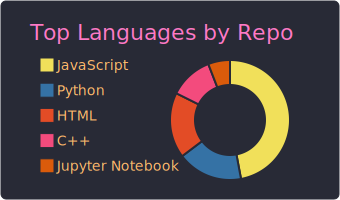
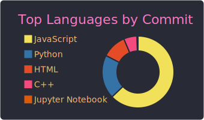

  

---

## 📡 COMMUNICATIONS MATRIX ARRAY

  &nbsp;&nbsp;
  &nbsp;&nbsp;
  &nbsp;&nbsp;
  

---

## ⚔️ COMBAT ENGAGEMENT SIMULATOR

  

---

## 🗃️ TELEMETRY GRID & CAMPAIGN LOGS

<table width="100%">
  <tr>
    <th width="50%" align="left">
      <h3 style="color: #a855f7;">🌌 STRATEGIC TRAJECTORY</h3>
    </th>
    <th width="50%" align="left">
      <h3 style="color: #f43f5e;">⚙️ HARDWARE ARSENAL</h3>
    </th>
  </tr>
  <tr>
    <td valign="top">
      <ul>
        <li><strong>Identity:</strong> Sharvin Sameer Mhatre</li>
        <li><strong>Base:</strong> B.Tech student in Electronics and Computer Science Engineering at <em>SIES Graduate School of Technology</em></li>
        <li><strong>Target Vector:</strong> Master of Science (MS) in Robotics at <em>TU Munich</em> (Technical University of Munich)</li>
        <li><strong>Service Vow:</strong> Technical Branch of the <em>Indian Air Force</em></li>
        <li><strong>Future Chapter:</strong> Launching <strong>"Axiom: The Kyber Collective"</strong> in August 2026</li>
      </ul>
    </td>
    <td valign="top">
      <ul>
        <li><strong>Core SoCs:</strong> ESP32 SoC, Arduino Uno</li>
        <li><strong>Sensory Matrix:</strong> Multi-Sensor Arrays (PIR, IR, Flame Systems)</li>
        <li><strong>Circuit Architecture:</strong> Custom dual-ground galvanic isolation circuit design</li>
      </ul>
    </td>
  </tr>
  <tr>
    <th align="left">
      <h3 style="color: #f43f5e;">🏆 CAMPAIGNS & VICTORIES</h3>
    </th>
    <th align="left">
      <h3 style="color: #a855f7;">💻 SOFTWARE MATRIX</h3>
    </th>
  </tr>
  <tr>
    <td valign="top">
      <ul>
        <li><strong>PromptWars Mumbai</strong> – AI Prompting Champion</li>
        <li><strong>PixelVerse UI/UX Hackathon</strong> – Grand Finale Contender</li>
        <li><strong>XPLOITATHON '26 CTF</strong> – Round 2 Advanced Status</li>
        <li><strong>India Agentic AI Open Hackathon</strong> – Contender</li>
        <li><strong>AMD Developer Hackathon: ACT II</strong> – Challenger</li>
        <li><strong>Bharatiya Antariksh Hackathon 2026</strong> – Team Prudence</li>
        <li><strong>UnPlugged 3.0 Hardware Hackathon</strong> – Finalist</li>
        <li><strong>Elite Coders Summer of Code (ECSoC '26)</strong> – Developer</li>
      </ul>
    </td>
    <td valign="top">
      <ul>
        <li><strong>Core Languages:</strong> Python, C++</li>
        <li><strong>High-Performance Compute:</strong> NVIDIA CUDA Toolkit, OpenACC Parallel Programming</li>
        <li><strong>Intelligence Integrations:</strong> Google AI Studio, OpenAI APIs, ElevenLabs</li>
        <li><strong>Operational Deployment:</strong> Web integrations for Spotify/YouTube Music (Cubet Hub)</li>
      </ul>
    </td>
  </tr>
</table>

---

## ⚡ CORE OPERATIONS & PROJECTS

*   **SafariSync:** Autonomous Wildlife Management node array leveraging distributed multi-agent system nodes.
*   **Tactical Fire-Fighting Drone Car Rig:** Custom-engineered autonomous firefighting vehicle rig that has completed over **150 rigorous hardware logic stress tests** to ensure functional reliability in harsh environments.

---

> [!IMPORTANT]
> ### 🧪 QUANTUM CALIBRATION ARRAY
> The local operational environment is calibrated according to Heisenberg's Uncertainty Principle:
> $$\Delta x \cdot \Delta p \ge \frac{\hbar}{2}$$

---

## 📊 3D CONTRIBUTION KINETICS (ISOMETRIC MATRIX)

<table width="100%">
  <tr>
    <td width="50%" align="center">
      <strong>🌌 SYSTEM CHRONOLOGY (NIGHT VIEW)</strong>  
      
    </td>
    <td width="50%" align="center">
      <strong>🌀 KINETIC GRID (ANIMATED SEASONAL)</strong>  
      
    </td>
  </tr>
</table>

   
  <strong>📈 KINETIC ACTIVITY TIMELINE (31-DAY ROLLING CORE)</strong>  
  

---

## 📈 SYSTEM STATUS CARDS (DRACULA OPERATIONAL MATRIX)

<table width="100%">
  <tr>
    <td width="50%" align="center">
      
    </td>
    <td width="50%" align="center">
      
    </td>
  </tr>
  <tr>
    <td width="50%" align="center">
      
    </td>
    <td width="50%" align="center">
      
    </td>
  </tr>
</table>

---

## ⚡ DYNAMIC GALACTIC METRICS (STAR WARS CUSTOM UI MATRIX)

  &nbsp;
  
    
  

